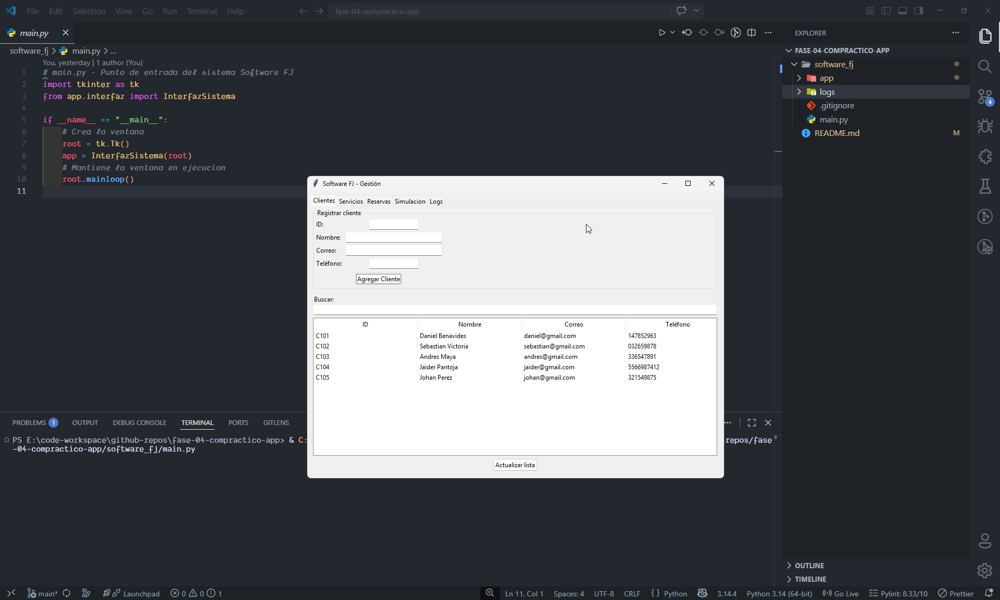
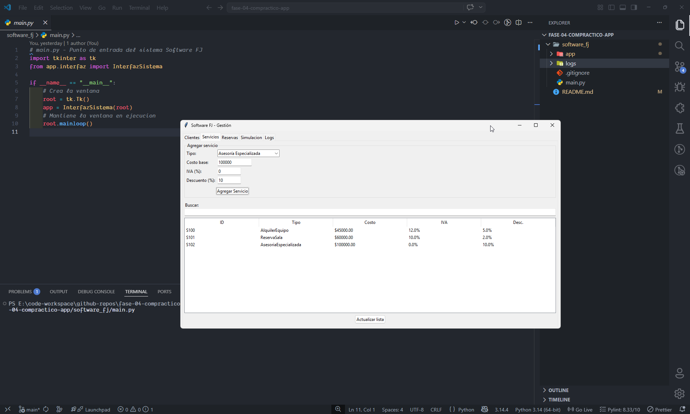
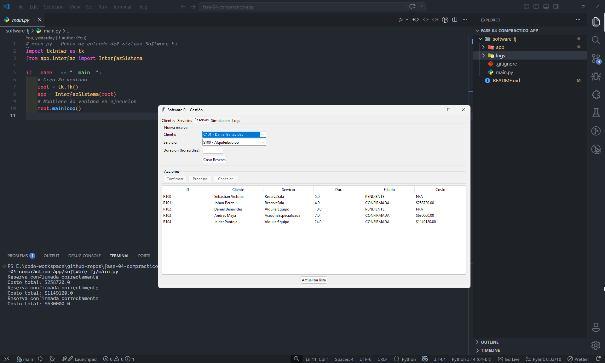
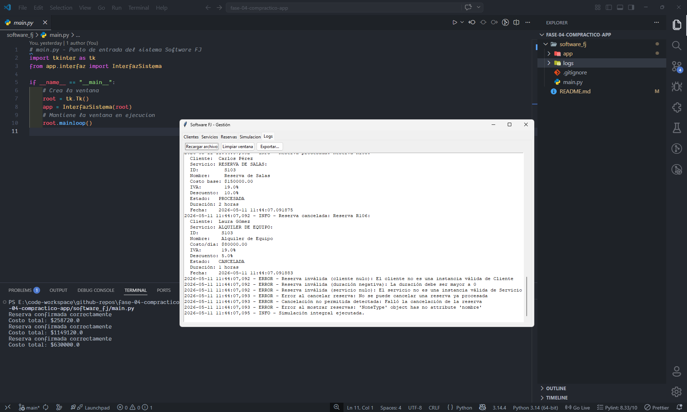

# Sistema Integral de Gestión de Clientes, Servicios y Reservas

**Curso:** Programación | **Código:** 213023 | **Grupo:** 231  
**Tutor:** Juan Pablo Arango Cardona

## Descripción

Proyecto académico desarrollado como parte del curso de Programación, que implementa un sistema integral orientado a objetos para la empresa **Software FJ**. La aplicación permite gestionar clientes, servicios (reserva de salas, alquiler de equipos y asesorías especializadas) y reservas, aplicando principios de abstracción, encapsulación, herencia, polimorfismo y manejo avanzado de excepciones. El sistema opera completamente en memoria, sin uso de bases de datos, y registra eventos y errores en un archivo de logs.

## Integrantes

| Nombre | Rol en el proyecto |
|--------|---------------------|
| Everson Daniel Cumbalaza Benavides | Líder de integración, módulo de servicios e interfaz gráfica |
| Andrés Felipe Maya Ortega | Clase abstracta raíz y gestión de clientes |
| Jaider Leonel Pantoja Goyes | Sistema de logs y simulación integral |
| Johan Steven Perez Molano | Clase Reserva y ciclo de vida |
| Sebastián Victoria González | Módulo de cálculo de costos |

## Estructura del proyecto

```
software_fj/
├── app/                    
│   ├── __init__.py
│   ├── entidades_base.py
│   ├── servicios.py
│   ├── calculos.py
│   ├── reservas.py
│   ├── logs.py
│   └── interfaz.py
├── logs/
├── main.py
└── README.md
```

## Instrucciones de ejecución

### 1. Clonar o descargar el repositorio

```bash
git clone <URL_DEL_REPOSITORIO>
```
También puede descargar el proyecto como archivo ZIP y descomprimirlo.

### 2. Abrir la terminal en la carpeta del proyecto

**En Windows:**

- **Método 1:** Presiona las teclas `Windows + R`, escribe `cmd` y pulsa Enter.
- **Método 2:** Abre el menú Inicio, escribe `Símbolo del sistema` y ábrelo.

Navega hasta la carpeta `software_fj` arrastrándola desde el explorador hasta la ventana de la terminal, o usando el comando `cd` seguido de la ruta:

```bash
cd C:\Users\TuUsuario\Desktop\software_fj
```

### 3. Ejecutar la aplicación

```bash
python main.py
```

`main.py` es el archivo que se debe ejecutar para iniciar el programa.

### 4. Usar el sistema

La interfaz gráfica se abrirá con pestañas para:

- **Clientes:** registrar y buscar clientes.
- **Servicios:** agregar servicios de salas, equipos o asesorías.
- **Reservas:** crear reservas y gestionar su ciclo de vida (confirmar, procesar, cancelar).
- **Simulación:** ejecutar una prueba integral de 10 operaciones válidas e inválidas.
- **Logs:** visualizar los eventos del sistema en tiempo real, recargar desde archivo, limpiar ventana y exportar.

Todos los eventos y errores quedan registrados automáticamente en `logs/sistema.log`.

## Evidencia de ejecución

### Pestaña Clientes


### Pestaña Servicios


### Pestaña Reservas


### Registro de Errores (Logs)


## Bitacora: Tabla de seguimiento

📍 [Google Drive - Tabla de Seguimiento](https://docs.google.com/spreadsheets/d/1bl06h4cMTIm26Lsd81yOmTBk-kr6u5q-pst-R238E7k/edit?usp=sharing "Ir a la tabla de seguimiento")

*Proyecto Colaborativo - 2026*